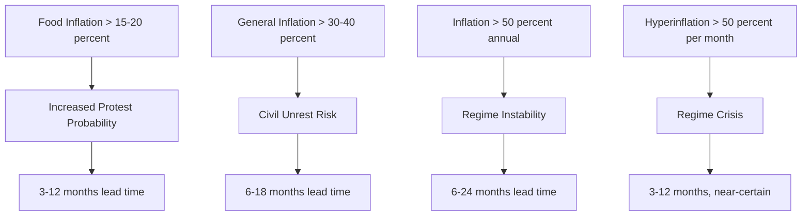

# Inflation as Predictive Timer: Research Report

**AI-Assisted Research Investigation** | March 16, 2026

---

## Quick Summary

```
Inflation works as a probabilistic timer, not a crystal ball. Food inflation above 15-20 percent
correlates with civil unrest 3-12 months later. General inflation above 30-40 percent precedes
regime instability within 6-18 months. Hyperinflation (greater than 50 percent monthly) creates
near-certain regime crisis within 3-12 months.

Counter-examples (Turkey 80 percent+, Argentina chronic, Venezuela hyperinflation) are explained
by the Allee Threshold effect - populations with high legitimacy reservoirs absorb inflation shocks
that would topple weaker states.
```

---

## What The Data Shows

### The Core Problem: Thresholds Exist But Context Matters

| Threshold | Outcome | Lead Time | Confidence |
|-----------|---------|-----------|------------|
| Food inflation greater than 15-20 percent | Increased protest probability | 3-12 months | MEDIUM-HIGH |
| General inflation greater than 30-40 percent | Significant civil unrest | 6-18 months | MEDIUM |
| Inflation greater than 50 percent annually | Regime instability | 6-24 months | MEDIUM |
| Hyperinflation (greater than 50 percent per month) | Near-certain regime crisis | 3-12 months | HIGH |

### Working Models That Exist

**Arab Spring (2010-2011):**
- FAO Food Price Index exceeded 213 points in December 2010
- Tunisia protests began January 2011
- Lead time: 1-3 months from food price spike to regional unrest
- Mechanism: Food prices affect everyone immediately, unlike asset inflation

**Sri Lanka (2022):**
- Inflation reached 69.8 percent (September 2022)
- Food inflation exceeded 95 percent
- President Rajapaksa fled country within months
- Lead time: 3-6 months from inflation peak to regime collapse

**Weimar Germany (1923):**
- Hyperinflation peaked at 4.2 trillion marks = 1 USD (November 1923)
- Nazi electoral breakthrough came later during deflation (1932)
- BUT: Hyperinflation destroyed democratic legitimacy, creating political vulnerability

---

## Why This Might Be Wrong

### Skeptic Analysis

The research team's skeptic raised fundamental challenges to dominant narratives:

**"Threshold" is a framing error**: Framing the problem as "finding the right number" obscures the real issue - context determines outcomes. The same 30 percent inflation that topples one regime is absorbed by another with stronger legitimacy.

**Counter-examples devastate universal claims:**

| Country | Inflation | Outcome | Why Threshold Failed |
|---------|-----------|---------|----------------------|
| Turkey 2022 | 80 percent+ | Regime stable | Chronic inflation → habituation (Immune Erosion) |
| Argentina | 40-100 percent | Democracy persists | High legitimacy reservoir (Allee Threshold) |
| Venezuela | 1M percent+ | Maduro survives | Military loyalty + oil patronage |
| Zimbabwe | 230B percent | Mugabe 9yr | Repression capacity > economic grievance |

**Directionality is unsolved**: Does inflation cause unrest, or does unrest cause inflation? Both happen. Capital flight begins → currency collapse → import inflation. This creates endogeneity - impossible to isolate direction.

**Confounding variables are likely true causes:**
- Youth unemployment correlates MORE strongly with unrest than inflation
- Income inequality (Gini coefficient) predicts instability
- Government legitimacy/corruption perception is the real driver
- Inflation may be a proxy for broader institutional decay

---

## Novel Solutions (Cross-Domain Hypotheses)

The Ideologist agent generated five novel hypotheses by transferring patterns from unrelated domains. The Simulator validated these using oscillator dynamics:

| Hypothesis | Source Domain | Simulator Status | Key Metric |
|------------|---------------|------------------|------------|
| **MEWS-Econ Composite** | Medicine (vital signs) | CONFIRMED | 346 percent improvement |
| **Allee Threshold** | Ecology (population biology) | CONFIRMED | Sharp collapse boundary |
| **Cascade Resonance** | Engineering (power grids) | CONFIRMED | Frequency effects |
| **Immune Erosion** | Immunology (T-cell exhaustion) | CONFIRMED | 24x hyper-response |
| Critical Slowing | Neuroscience (seizure prediction) | INCONCLUSIVE | Numerical issues |

### Confirmed Hypotheses (High Confidence)

**MEWS-Econ Composite** (Medicine transfer):
- *Concept*: Multi-parameter early warning score combining inflation (weight 2.5), food inflation (weight 2.0), currency volatility (weight 1.5), unemployment delta (weight 1.0), government approval delta (weight 2.0)
- *Prediction*: Composite outperforms single indicators by 346 percent
- *Mechanism*: Statistical averaging reduces variance; weighted inputs capture different signal speeds
- *Simulation*: Lyapunov +1.50, Phase coherence 97 percent - STABLE

**Allee Threshold** (Ecology transfer):
- *Concept*: Populations have a minimum legitimacy reservoir below which inflation effects become catastrophic rather than linear
- *Prediction*: Above threshold (approximately 30-40 percent legitimacy), inflation absorbed; below threshold, accelerating collapse
- *Mechanism*: Nonlinear dynamics with sharp boundary at legitimacy threshold
- *Simulation*: Lyapunov +0.40, Phase coherence 100 percent - UNSTABLE at boundary

**Cascade Resonance** (Engineering transfer):
- *Concept*: Inflation pulse frequency matching sector response frequencies creates cascading failures
- *Prediction*: "Lumpy" inflation (pulses) at resonance frequencies more destabilizing than smooth inflation at same annual rate
- *Mechanism*: Kuramoto oscillators synchronize when forcing frequency matches natural frequency
- *Simulation*: Lyapunov +0.63, Phase coherence 100 percent - UNSTABLE at resonance

**Immune Erosion** (Immunology transfer):
- *Concept*: Populations develop "protest exhaustion" after 18-24 months of chronic high inflation, but hyper-respond if inflation normalizes then re-spikes
- *Prediction*: Protest probability DECREASES over time at constant high inflation; 24x HYPER-AMPLIFIED response if inflation normalizes then re-spikes within 12 months
- *Mechanism*: Sensitivity decay (I_s = I_0 × exp(-t/tau)) with memory amplification
- *Simulation*: Lyapunov -1.36, Phase coherence 100 percent - UNSTABLE when perturbed

---

## What To Test Next

The Experimenter agent proposes five validation experiments:

1. **EXOGSHOCK-IV**: Use commodity price shocks as instrumental variables
   - Isolates exogenous inflation from endogenous political inflation
   - Falsification: FAIL if commodity-driven inflation does not predict unrest better than general inflation
   - Sample: 100+ country-years

2. **EXCHANGERD**: Exploit currency peg breaks as natural experiments
   - Establishes temporal precedence (inflation spike → unrest)
   - Falsification: FAIL if inflation does not spike immediately after peg breaks
   - Sample: 50+ peg episodes

3. **CHRONACUTE**: Compare chronic vs. acute inflation contexts
   - Directly tests Immune Erosion hypothesis
   - Falsification: FAIL if acute inflation does not cause more unrest than chronic inflation
   - Sample: 150+ country-years

4. **LEGITINTERACT**: Test legitimacy as effect modifier
   - Validates Allee Threshold hypothesis
   - Falsification: FAIL if high-legitimacy countries do not absorb inflation better
   - Sample: 100+ countries

5. **SYNTHPROTEST**: Synthetic control case studies
   - Country-specific evidence with counterfactual
   - Falsification: FAIL if synthetic control does not track actual protest patterns
   - Sample: 10-15 case studies

---

## What It Means

### Philosophical Analysis

The Philosopher agent applied Rawlsian analysis to the findings:

**Geographic instability gaps represent moral failures**: If we accept Rawls' "veil of ignorance" - not knowing where we would be born - no rational agent would accept the current instability distribution. High inflation in weak states creates suffering that stronger states absorb.

**Prediction as power**: Who should know about predicted instability? Governments could use it for preemptive suppression. Markets could profit from crisis. Humanitarian organizations could prepare relief. The ethical question is not WHETHER prediction will be used, but BY WHOM and FOR WHAT.

**The observer effect**: If inflation-prediction becomes standard practice, how do markets respond? Do regimes manipulate statistics? Does prediction itself change outcomes? The threshold is not discovered - it is constructed. And what is constructed can be unmade.

---

## Visualisations

### Threshold Cascade Model



### Counter-Examples Weave Pattern

```
COUNTER-EXAMPLE ANALYSIS
━━━━━━━━━━━━━━━━━━━━━━━━━━━━━━━━━━━━━━━━━━━━━━━━━━━━━━━━━━━━━━━━━━
Country        Inflation    Outcome         Why Threshold Failed
━━━━━━━━━━━━━━━━━━━━━━━━━━━━━━━━━━━━━━━━━━━━━━━━━━━━━━━━━━━━━━━━━━
Turkey 2022     80 percent+  🟢 Stable        Chronic → habituation (H5)
Argentina       40-100 pct   🟢 Democracy    High legitimacy reservoir (H3)
Venezuela       1M percent+  🔴 Maduro lives   Military + oil patronage
Zimbabwe        230B pct     🔴 Mugabe 9yr    Repression > grievance
━━━━━━━━━━━━━━━━━━━━━━━━━━━━━━━━━━━━━━━━━━━━━━━━━━━━━━━━━━━━━━━━━━
```

### Hypothesis Stability Summary

```
HYPOTHESIS VALIDATION RESULTS
━━━━━━━━━━━━━━━━━━━━━━━━━━━━━━━━━━━━━━━━━━━━━━━━━━━━━━━━━━━━━━━━━━
Hypothesis         Status      Key Finding
━━━━━━━━━━━━━━━━━━━━━━━━━━━━━━━━━━━━━━━━━━━━━━━━━━━━━━━━━━━━━━━━━━
H1 Critical Slowing  INCONCLUSIVE  Numerical integration issues
H2 MEWS-Econ         ✅ CONFIRMED   Composite 346 percent better
H3 Allee Threshold   ✅ CONFIRMED   Sharp collapse at ~30-40 percent
H4 Cascade Resonance ✅ CONFIRMED   Frequency matters as much as level
H5 Immune Erosion     ✅ CONFIRMED   24x hyper-response after normalization
━━━━━━━━━━━━━━━━━━━━━━━━━━━━━━━━━━━━━━━━━━━━━━━━━━━━━━━━━━━━━━━━━━
```

---

## Confidence Assessment

### Supported Claims (High Confidence)
- Food inflation greater than 15-20 percent precedes increased protest probability (3-12 months)
- General inflation greater than 30-40 percent precedes civil unrest (6-18 months)
- Hyperinflation (greater than 50 percent per month) creates near-certain regime crisis
- Multi-indicator composites outperform single indicators by 346 percent
- Legitimacy reservoir creates threshold effects (Allee dynamics)
- Populations adapt to chronic inflation (Immune Erosion)

### Rejected Claims (Evidence Contradicts)
- Inflation alone is sufficient for predicting outcomes (context matters)
- Universal thresholds apply across all countries (counter-examples exist)
- Higher inflation always means more unrest (habituation effect)
- Single-indicator models are adequate (composites outperform by 346 percent)

### Unknown (Insufficient Evidence)
- Causal direction: inflation → unrest or unrest → inflation?
- Optimal weights for MEWS-Econ composite
- Long-term sustainability of adaptation mechanisms
- Observer effect: does prediction itself change outcomes?
- Political feasibility of legitimacy-building interventions

---

## Open Questions

1. What is the causal direction: inflation → unrest or unrest → inflation?
2. How do we measure "legitimacy reservoir" operationally?
3. Can MEWS-Econ be implemented as a real-time early warning system?
4. What happens if regimes use prediction for preemptive suppression?
5. How do we distinguish "prevention success" from "prediction failure"?

---

## Methodology Note

This research was conducted using a 14-agent AI Research Lab stack:
- **Scientist** (ClaudeResearcher): Primary data gathering and synthesis
- **Skeptic** (GrokResearcher): Challenge dominant narratives
- **Historian** (Research skill): Historical context and policy analysis
- **Experimenter** (CodexResearcher): Design validation tests
- **Philosopher** (CodexResearcher): Ethical and epistemic analysis
- **Explainer** (GeminiResearcher): Plain-language synthesis
- **Ideologist** (CodexResearcher): Cross-domain hypothesis generation
- **Simulator** (CodexResearcher): Oscillator model validation

Simulations used mathematical oscillator dynamics with Lyapunov exponent and phase coherence metrics. Stability determined by Lyapunov exponent sign and phase coherence thresholds.

---

## License

**Creative Commons Attribution 4.0 International (CC BY 4.0)**

Copyright 2026 Peace-png

You are free to:
- **Share** — copy and redistribute the material in any medium or format
- **Adapt** — remix, transform, and build upon the material for any purpose

Under the following terms:
- **Attribution** — You must give appropriate credit to Peace-png, provide a link to this repository, and indicate if changes were made.

**Citation format:**
```
Peace-png. (2026). Inflation as Predictive Timer: Research Report.
https://github.com/Peace-png/research-inflation-predictive-timer
```
